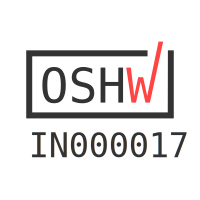

ProtoCentral ADS1292R ECG/respiration shield and breakout board 
================================

[  
Dont have it yet? But one here: ADS1292R ECG/Respiration Shield for Arduino- v2 (PC-4128)](https://protocentral.com/product/ads1292r-ecg-respiration-shield-for-arduino-v2/)

[  
Dont have it yet? But one here: ADS1292R ECG/Respiration Breakout for Arduino- v3 (PC-4116)](https://protocentral.com/product/ads1292r-ecg-respiration-breakout-kit/)

The Arduino library for this product is now available in the **[ProtoCentral ADS1292R Arduino Library repo](https://github.com/Protocentral/protocentral-ads1292r-arduino)**

Easily monitor ECG and respiration using your Arduino with this plug-in shield. The version 2 of this product adds a new SPI pin header making it compatible with newer Arduino devices including the Arduino Yun and 3.5mm connector for the electrodes. We now include the electrodes and cable also with the shield

Just plug it into an Arduino and you're ready to go. The 3.5 mm circular connector provides an easy way to connect electodes to the shield. The other end of this cable has snaps for standard ECG electrodes. We also include a pakc of 10 disposable EG electrodes. It accepts two ECG electrodes and one Driven Right Leg (DRL) electrode for common mode noise reduction. 

Another interesting feature of this shield is that you can also measure the respiratory activity using the same two electrodes connected to the shield. The ADS1292R uses a method known as impedance pneumography to measure respiration using the changes in chest impedance caused during respiration. 

Features:
----------
* ADS1292R Analog Front End IC
* Onboard 3.3V voltage regulator for low noise
* Onboard logic level transalators for Arduino interface
* Prototyping area for adding addtional components

Includes:
----------
* ADS1292R Arduino shield
* Electrode cable with 3.5mm connector and ECG electrodes connectors
* Pack of 10 disposable stick-on ECG electrodes.

Connecting the shield to your Arduino
-------------------------------------
Connect the ECG/Respiration shield to the Arduino by stacking it on top of your Arduino. This shield uses the SPI interface  to communicate with the Arduino. Since this includes the ICSP header, which is used on newer Arduinos for SPI communication,  this shield is also compatible newer Arduino boards such as the Arduino Yun and Due.
 
Wiring the Breakout to your Arduino
------------------------------------
 If you have bought the breakout the connection with the Arduino board is as follows:
 
|ads1292r pin label| Arduino Connection   |Pin Function      |
|----------------- |:--------------------:|-----------------:|
| VDD              | +5V                  |  Supply voltage  |             
| PWDN/RESET       | D4                   |  Reset           |
| START            | D5                   |  Start Input     |
| DRDY             | D6                   |  Data Ready Outpt|
| CS               | D7                   |  Chip Select     |
| MOSI             | D11                  |  Slave In        |
| MISO             | D12                  |  Slave Out       |
| SCK              | D13                  |  Serial Clock    |
| GND              | Gnd                  |  Gnd             |
 
Installing the Arduino libraries 
---------------------------------
Arduino library for this boards is now available at https://github.com/Protocentral/protocentral-ads1292r-arduino or from the Arduino Library Manager inside the Arduino IDe. 

If you have correctly installed the libraries, the example sketeches should now be available from within Arduino at File-->Examples-->ProtoCentral ADS1292R library.

 
Using the ProtoCentral OpenView GUI
-----------------------------------

The GUI for visualizing the ECG and Respiration as well as parameters like Heart rate and Respiration rate is written in Processing, based on Java and is cross-compilable across platforms. 
 
Java 8 is required on all platforms for running the processing-based GUI application. You can download Java for your platform from the [Official Java website](https://java.com/en/download/).

You can download and install [ProtoCentral OpenView](https://github.com/Protocentral/protocentral_openview) from here: https://github.com/Protocentral/protocentral_openview

Connecting the ECG Electrodes
------------------------------
 A 3-electrode cable along with a standard stereo jack is provided along with the shield to connect the electrodes to the     shield. The electrode input connector is highlighted in the below picture.
 
 The other side of the electrode connector would connect to snap-on electrodes attached to the body. For testing purposes,    you can use an ECG simulator to provide inputs to the board. 

 Warning:
 When connecting the electodes to the body, it is safer to disconnect the mains power source to the Arduino. For example, if  you are using the Arduino along with a laptop, disconnecting the battery charger from the laptop would be a safe option.
 
Placing the Electrodes on the body
---------------------------------

License Information
===================
This product is open source! 

Both, our hardware and software are open source and licensed under the following licenses:

 

Hardware
---------

**All hardware is released under the [CERN-OHL-P v2](https://ohwr.org/cern_ohl_p_v2.txt)** license.

Copyright CERN 2020.

This source describes Open Hardware and is licensed under the CERN-OHL-P v2.

You may redistribute and modify this documentation and make products
using it under the terms of the CERN-OHL-P v2 (https:/cern.ch/cern-ohl).
This documentation is distributed WITHOUT ANY EXPRESS OR IMPLIED
WARRANTY, INCLUDING OF MERCHANTABILITY, SATISFACTORY QUALITY
AND FITNESS FOR A PARTICULAR PURPOSE. Please see the CERN-OHL-P v2
for applicable conditions

Software
--------

**All software is released under the MIT License(http://opensource.org/licenses/MIT).**

THE SOFTWARE IS PROVIDED "AS IS", WITHOUT WARRANTY OF ANY KIND, EXPRESS OR IMPLIED, INCLUDING BUT NOT LIMITED TO THE WARRANTIES OF MERCHANTABILITY, FITNESS FOR A PARTICULAR PURPOSE AND NONINFRINGEMENT. IN NO EVENT SHALL THE AUTHORS OR COPYRIGHT HOLDERS BE LIABLE FOR ANY CLAIM, DAMAGES OR OTHER LIABILITY, WHETHER IN AN ACTION OF CONTRACT, TORT OR OTHERWISE, ARISING FROM, OUT OF OR IN CONNECTION WITH THE SOFTWARE OR THE USE OR OTHER DEALINGS IN THE SOFTWARE.

Documentation
-------------
**All documentation is released under [Creative Commons Share-alike 4.0 International](http://creativecommons.org/licenses/by-sa/4.0/).**

You are free to:

* Share — copy and redistribute the material in any medium or format
* Adapt — remix, transform, and build upon the material for any purpose, even commercially.
The licensor cannot revoke these freedoms as long as you follow the license terms.

Under the following terms:

* Attribution — You must give appropriate credit, provide a link to the license, and indicate if changes were made. You may do so in any reasonable manner, but not in any way that suggests the licensor endorses you or your use.
* ShareAlike — If you remix, transform, or build upon the material, you must distribute your contributions under the same license as the original.

Please check [*LICENSE.md*](LICENSE.md) for detailed license descriptions.